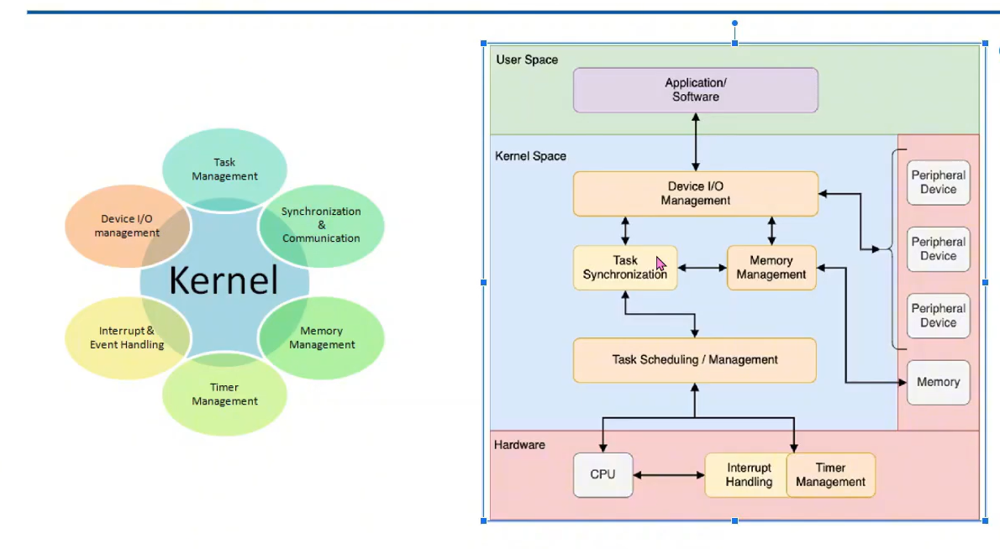
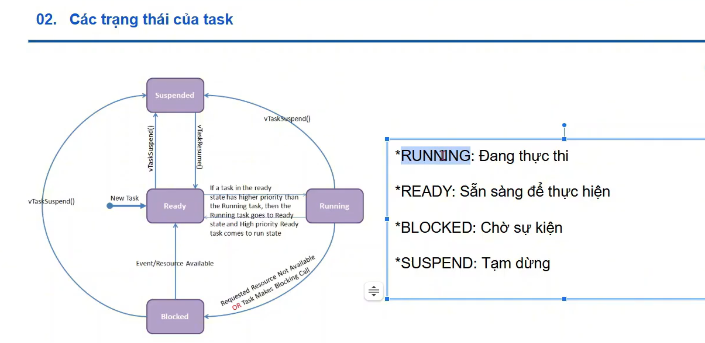
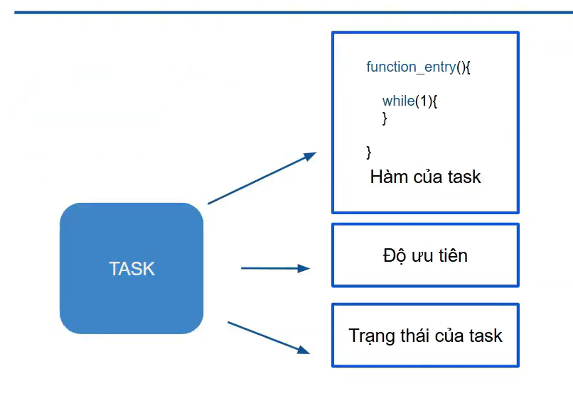
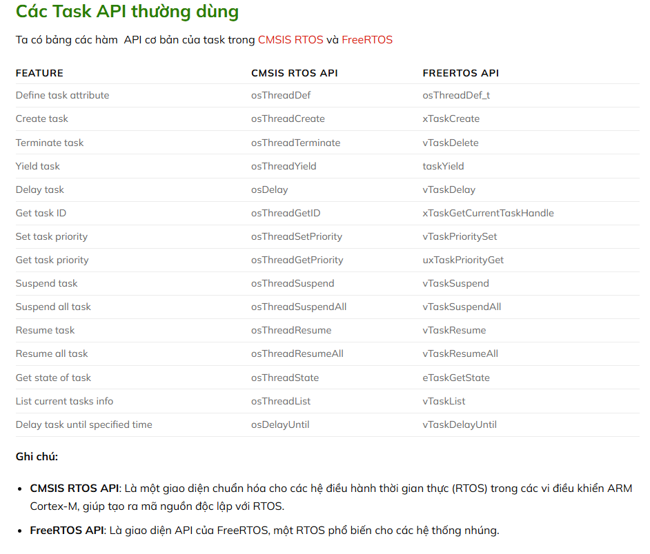
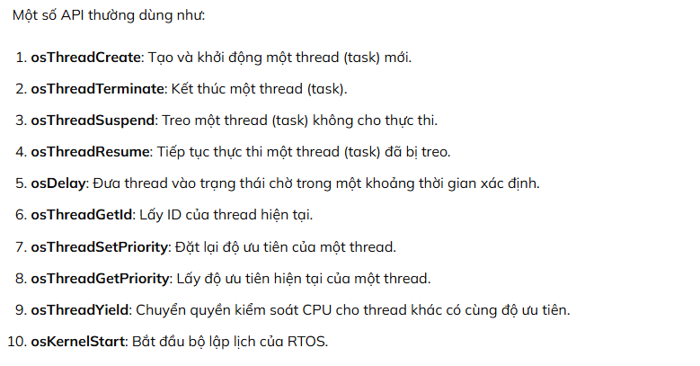

# RTOS

## Mục lục
- [1. RTOS là gì?](#1-rtos-là-gì)
- [2. Đặc trưng RTOS](#2-đặc-trưng-rtos)
- [3. Task State](#3-task-state)
- [4. Scheduling](#4-scheduling)
- [5. Delay note](#5-delay-note)

---

## 1. RTOS là gì?
RTOS (Real-Time Operating System) là hệ điều hành thời gian thực cho vi điều khiển, dùng để điều khiển thiết bị theo kiểu đa nhiệm (multi-tasking) và có thời gian đáp ứng dự đoán được.

### Operating System
Quản lý tài nguyên phần cứng & phần mềm:
- bộ nhớ
- I/O
- giao tiếp
- file system
- bộ nhớ ảo
- bảo mật

### Shell
Chương trình dùng để thực thi chương trình khác  
*VD:* bash (UNIX), explorer.exe (Windows), command (MS-DOS)

### Kernel

Đảm nhiệm:
- quản lý thời gian
- task scheduling
- memory management
- file system

---

## 2. Đặc trưng RTOS
- high performance
- safety & security
- priority-based scheduling
- kích thước nhỏ

---

## 3. Task State

| State | Ý nghĩa |
|---|---|
| RUNNING | đang chiếm CPU |
| READY | đủ điều kiện chạy nhưng đang đợi CPU |
| BLOCKED | đang chờ điều kiện (timeout, queue, semaphore…) |
| SUSPEND | bị tạm dừng bởi lệnh suspend |

---

## 4. Scheduling

**Priority-based preemptive scheduling**

- mỗi task có priority
- task priority cao chạy trước
- nếu task mới có priority cao hơn → kernel sẽ preempt task hiện tại

Tóm tắt:
1) priority cao → chạy trước  
2) nếu priority cao không block → task khác không được chạy  

---

## 5. Delay note và các Task API hay dùng

| API | Ảnh hưởng |
|---|---|
| `HAL_Delay()` | block toàn hệ thống |
| `osDelay()` | chỉ block task hiện tại, các task khác vẫn chạy |
- Link: https://khuenguyencreator.com/stm32-rtos-cac-trang-thai-cua-task/

